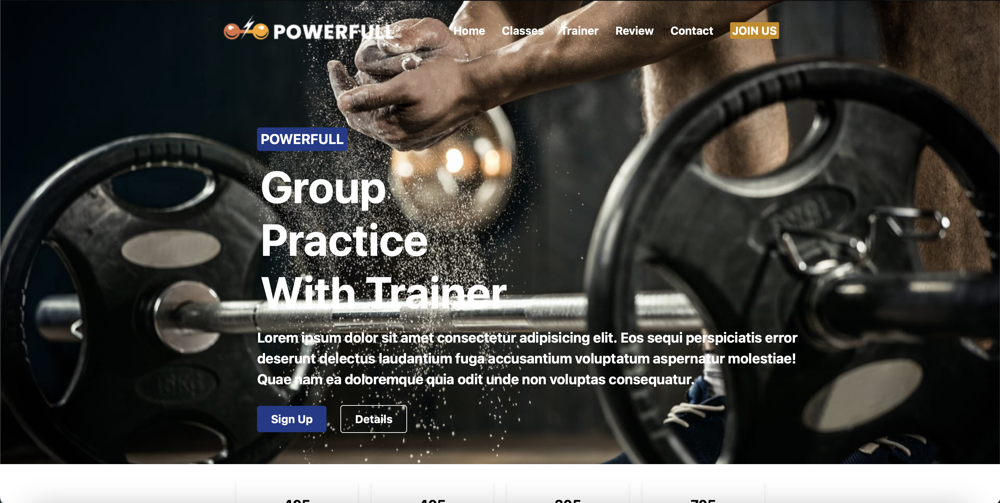

# SportCenter Projesi

Bu proje, bir spor merkezi web sitesi oluşturmak için geliştirilmiştir. Proje, HTML, CSS ve JavaScript kullanılarak oluşturulmuştur ve kullanıcı dostu bir arayüz sunmaktadır.

## Proje Bağlantısı

🔗 [Canlı Demo](https://lucent-pothos-46b21d.netlify.app)

## Proje Görüntüsü

## Kullanılan Teknolojiler

- **HTML**: Sayfa yapısını oluşturmak için kullanılmıştır.
- **CSS**: Sayfa stilini ve düzenini oluşturmak için kullanılmıştır.
- **JavaScript**: Sayfa etkileşimlerini ve dinamik içerikleri yönetmek için kullanılmıştır.
- **Tailwind CSS**: Hızlı ve kolay stil oluşturmak için kullanılmıştır.

## Proje İçeriği

### Navbar

- **Responsive Navbar**: Hem masaüstü hem de mobil cihazlar için uyumlu bir navigasyon çubuğu.
- **Mobile Menu**: Mobil cihazlarda kullanılmak üzere gizlenebilir bir menü.

### Ana Sayfa

- **Başlık ve Açıklama**: Spor merkezi hakkında kısa bir tanıtım.
- **İstatistik Kutuları**: Çalışma saatleri, mutlu müşteriler gibi istatistikler.

### Sınıflar

- **Sınıf Tanıtımları**: Yoga, grup çalışmaları, solo çalışmalar ve esneme gibi sınıfların tanıtımları.
- **Tab Menüsü**: Farklı sınıflar arasında geçiş yapmayı sağlayan butonlar.

### BMI Hesaplayıcı

- **BMI Hesaplama Formu**: Kullanıcıların boy ve kilo bilgilerini girerek BMI değerlerini hesaplayabilecekleri bir form.
- **Sonuç Gösterimi**: Hesaplanan BMI değerine göre kullanıcıya sonuç ve kategori gösterimi.

### Eğitmenler

- **Eğitmen Kartları**: En iyi eğitmenlerin tanıtıldığı kartlar.
- **Hover Efekti**: Eğitmen kartlarının üzerine gelindiğinde eğitmen isimlerinin görünmesi.

### Ürünler

- **Ürün Kartları**: Satın alınabilecek spor ekipmanlarının tanıtıldığı kartlar.
- **Sepete Ekle Butonu**: Ürünleri sepete eklemeyi sağlayan butonlar.

### Yorumlar

- **Müşteri Yorumları**: Müşterilerin spor merkezi hakkındaki yorumları.

### İletişim

- **İletişim Formu**: Kullanıcıların spor merkezi ile iletişime geçebilecekleri bir form.
- **Harita**: Spor merkezinin konumunu gösteren bir harita.

### Footer

- **Bilgi ve Bağlantılar**: Spor merkezi hakkında bilgi ve faydalı bağlantılar.

## Katkıda Bulunanlar

- **İlayda**: Proje yöneticisi ve baş geliştirici.

## Lisans

Bu proje MIT Lisansı ile lisanslanmıştır. Daha fazla bilgi için `LICENSE` dosyasına bakın.